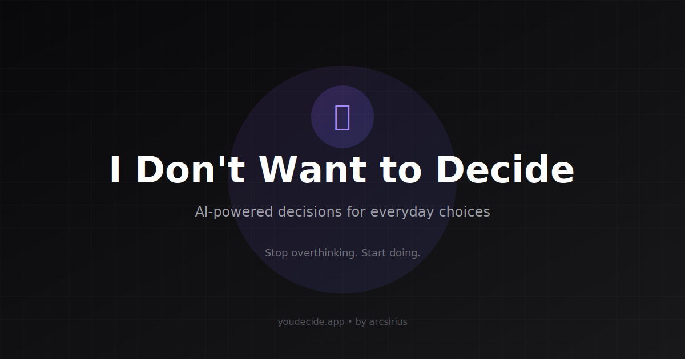

# 🧠 Decision Fatigue Ends Here

> Stop thinking. Start doing. When your brain is tired, let AI decide.

[](https://youdecide.arcsirius.com)
[](https://react.dev)
[](https://ai.google.dev)



## ✨ Features

- **🧠 Mental Load Relief** - Overthinking? Brain tired? Just press decide
- **🎯 Quick Templates** - Pre-built: Food, Activities, Work, Workout, Shopping
- **🎤 Voice Input** - Add options by speaking
- **😊 Mood & Energy Aware** - Picks based on how you're feeling
- **📱 Mobile-First** - Works great on all devices
- **⚡ PWA Ready** - Install as an app
- **🔒 Privacy First** - Your decisions stay on your device

## 🚀 Live Demo

**[https://youdecide.arcsirius.com](https://youdecide.arcsirius.com)**

## 🛠️ Tech Stack

- **Frontend**: React 18 + Vite 5
- **Styling**: Tailwind CSS 3
- **Animations**: Framer Motion
- **Icons**: Lucide React
- **AI**: Google Gemini 2.5 Flash
- **Deployment**: Vercel

## 📦 Installation

```bash
# Clone the repository
git clone https://github.com/TahoorBR/youdecide.git
cd youdecide

# Install dependencies
npm install

# Create environment file
echo "VITE_GEMINI_API_KEY=your_gemini_api_key_here" > .env.local

# Start development server
npm run dev
```

## 🔑 Getting a Gemini API Key

1. Go to [Google AI Studio](https://aistudio.google.com/apikey)
2. Create a new API key
3. Add it to your `.env.local` file

## 📱 How to Use

1. **Pick a category** - Choose from Food, Activities, Work, etc.
2. **Add your options** - Type or use voice input 🎤
3. **Set your mood & energy** - Let the AI know how you're feeling
4. **Get your decision** - AI picks the best option with reasoning

## 🗣️ Voice Input

Click the microphone button and speak your options naturally:
- "Pizza, sushi, and burger"
- "Watch a movie, read a book, or go for a walk"

The app will parse and add all options automatically.

## 🌐 Deployment

### Vercel (Recommended)

1. Push to GitHub
2. Import project on [Vercel](https://vercel.com)
3. Add environment variable: `VITE_GEMINI_API_KEY`
4. Deploy!

### Manual Build

```bash
npm run build
# Output in ./dist
```

## 📁 Project Structure

```
youdecide/
├── public/
│   ├── manifest.json     # PWA manifest
│   ├── robots.txt        # SEO
│   ├── sitemap.xml       # SEO
│   └── brain.svg         # App icon
├── src/
│   ├── App.jsx           # Main app component
│   ├── geminiService.js  # Gemini AI integration
│   ├── decisionEngine.js # Fallback logic
│   ├── useSpeechToText.js# Voice input hook
│   └── index.css         # Tailwind styles
├── vercel.json           # Vercel config
└── index.html            # Entry with SEO meta
```

## 🤝 Support

If this app helped you make a decision, consider buying me a coffee!

[](https://buymeacoffee.com/arcsirius)

## 📄 License

MIT © [arcsirius](https://buymeacoffee.com/arcsirius)

---

Made with ❤️ by [arcsirius](https://buymeacoffee.com/arcsirius)
